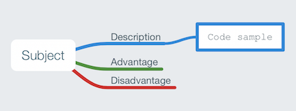
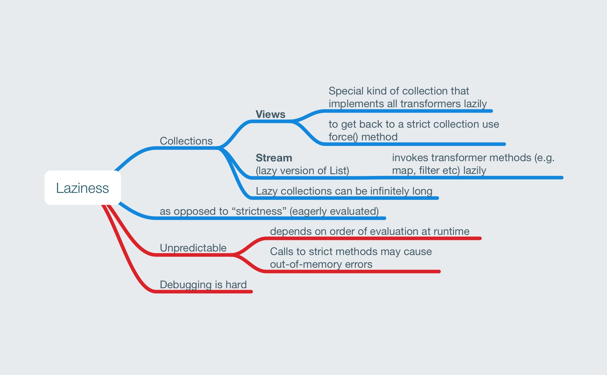

[Mindnode](https://mindnode.com) mind maps to aid learning Scala and Java

A work in progress - pull requests gladly accepted.

See also: [mindmaps-data-structures](https://github.com/chrisbeach/mindmaps-data-structures)

### Key

# General

## Design Patterns in Scala vs Java

# Concurrency

## Locks and Concurrency Control

## Liveness Problems

## Futures and Promises in Scala

## Scala Async

## Actor Pattern and Akka

# Types and Scopes

## Covariance and Contravariance in Scala

## Implicits in Scala

## Type Classes in Scala

## Laziness

# Data Structures

## Functors and Monads in Scala

* See: https://medium.com/zendesk-engineering/dont-fear-the-monad-f424260f29f6

## Immutable Collections in Scala

