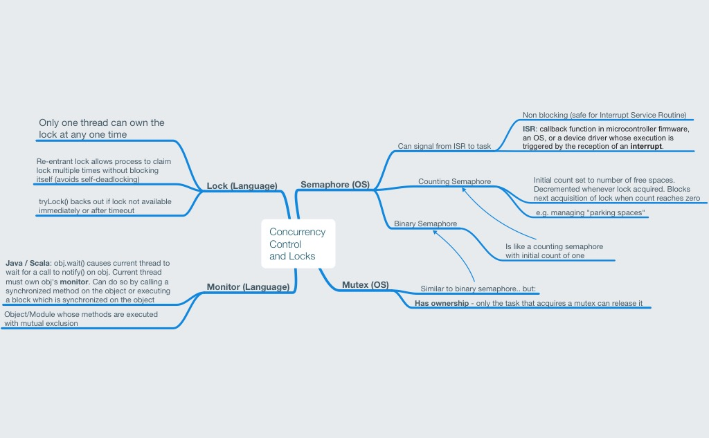

[Mindnode](https://mindnode.com) mind maps to aid learning Scala and Java

A work in progress - pull requests gladly accepted.

### Key

# General

## Design Patterns in Scala vs Java

# Concurrency

## Locks and Concurrency Control

## Futures and Promises in Scala

# Types

## Covariance and Contravariance in Scala

## Functors and Monads in Scala

## Immutable Collections in Scala

